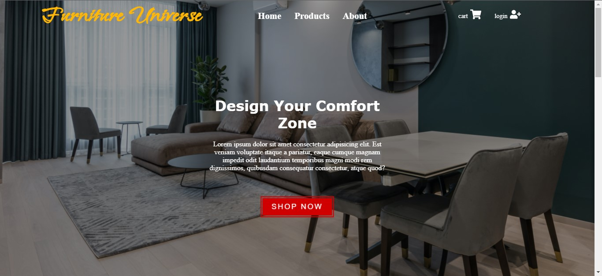

# A Complete E-Commerce Store That Sells Furniture 

The functions available in this project include:

- ***Routing*** to enable quick navigation through pages.
- ***Filtering options*** for the products, which can be scaled up to include as many filtering options as you want.
- ***Database access*** via firestore to enable modifying or adding products to the website. 
- ***Authentication capability*** via firebase to enable logging in and signing in.
- ***Private routes*** to prevent access to specific pages before logging in.
- ***Add to cart*** option, that saves the added products to a database if the user is signed in.
- ***Payment processing*** via stripe to receive payments when a user orders products.

# Images

## Home Page

## Languages Used
`React.js`
`Firebase`